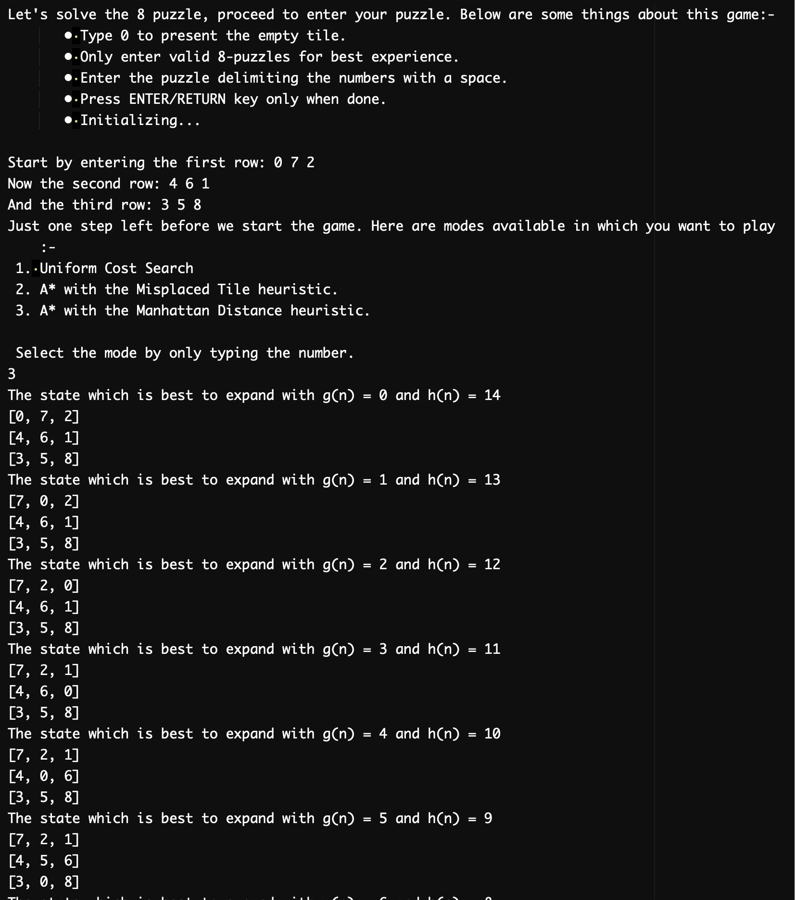

# eight_puzzle_solver_AI

Code is under main.swift file -> eight_puzzle_solver_AI/CS205_Project1_Rachit_Prajapati/Project1_files

8 puzzle is one of the famous game in the form of a mechanical toy.
An intuitive problem in the field of Artificial Intelligence, where it is being solved by following heurisitics algorithm:- 
1. Uniform Cost Search (UCS)
2. A* with Misplaced tile heuristic
3. A* with Manhattan distance heuristic

Below is a picture of the preview of this game. 

